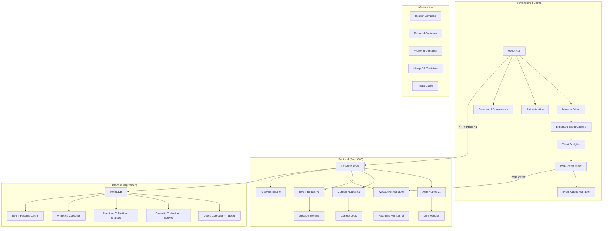

# Design Document

## Overview

The Anti-Plagiarism AI system is architected as a modern full-stack web application with clear separation of concerns. The system uses a microservices-inspired approach with a FastAPI backend providing RESTful APIs, a React frontend with real-time editor monitoring, and MongoDB for persistent storage. The architecture is designed to be scalable, maintainable, and ready for future AI integration.

## Architecture



## Components and Interfaces

### Backend Components

#### 1. FastAPI Application (`main.py`)
- **Purpose**: Main application entry point and configuration
- **Responsibilities**: 
  - CORS configuration for frontend communication
  - Route registration and middleware setup
  - WebSocket connection management
  - API versioning setup (/api/v1/)
  - Application lifecycle management
- **Port**: 9000
- **Base Path**: `/api/v1`

#### 2. Database Layer (`db.py`)
- **Purpose**: MongoDB connection and configuration using Motor (async driver)
- **Responsibilities**:
  - Async database connection management
  - Collection access methods
  - Connection pooling and error handling

#### 3. Authentication System (`auth.py`)
- **Purpose**: JWT-based authentication and authorization
- **Responsibilities**:
  - Password hashing using bcrypt
  - JWT token generation and validation
  - User role-based access control
- **Environment**: Uses `JWT_SECRET` from environment variables

#### 4. Data Schemas (`schemas.py`)
- **Purpose**: Pydantic models for request/response validation
- **Models**:
  - `UserCreate`, `UserLogin`, `UserResponse`
  - `ContestCreate`, `ContestResponse`
  - `SessionEvent`, `SessionData`

#### 5. Route Handlers (API v1)
- **Auth Routes** (`routes/auth_routes.py`):
  - `POST /api/v1/auth/register` - User registration
  - `POST /api/v1/auth/login` - User authentication
- **Contest Routes** (`routes/contest_routes.py`):
  - `POST /api/v1/contests` - Create contest
  - `GET /api/v1/contests` - List contests
  - `POST /api/v1/contests/{contest_id}/join` - Join contest
- **Event Routes** (`routes/event_routes.py`):
  - `POST /api/v1/events` - Store session events (batch)
  - `GET /api/v1/sessions/{session_id}` - Retrieve session data
  - `WebSocket /api/v1/ws/{session_id}` - Real-time event streaming

#### 6. WebSocket Manager (`websocket_manager.py`)
- **Purpose**: Real-time communication and monitoring
- **Responsibilities**:
  - WebSocket connection lifecycle management
  - Real-time event broadcasting
  - Connection pooling and cleanup
  - Heartbeat monitoring

#### 7. Analytics Engine (`analytics.py`)
- **Purpose**: Client-side and server-side event analysis
- **Responsibilities**:
  - Pattern detection in typing behavior
  - Anomaly detection for potential plagiarism
  - Performance metrics calculation
  - Pre-processing event data

### Frontend Components

#### 1. Application Shell (`App.jsx`)
- **Purpose**: Main application component with routing
- **Responsibilities**:
  - React Router configuration
  - Global state management
  - Authentication context

#### 2. API Layer (`api.js`)
- **Purpose**: Centralized HTTP client configuration
- **Responsibilities**:
  - Axios instance with base URL configuration
  - Automatic JWT token injection
  - Request/response interceptors

#### 3. Authentication Pages
- **Login** (`pages/Login.jsx`): User authentication form
- **Register** (`pages/Register.jsx`): User registration form
- **Features**: Form validation, error handling, role selection

#### 4. Dashboard Components
- **Host Dashboard** (`pages/HostDashboard.jsx`): Contest management interface
- **Participant Dashboard** (`pages/ParticipantDashboard.jsx`): Contest participation interface
- **Contest Create** (`pages/ContestCreate.jsx`): Contest creation form

#### 5. Enhanced Editor System
- **Editor Session** (`components/EditorSession.jsx`):
  - Monaco Editor integration with comprehensive event capture
  - WebSocket real-time communication
  - Client-side analytics and pattern detection
  - Enhanced error handling with retry mechanisms
  - Consent management and privacy controls
  - Session ID generation using UUID
  - Intelligent event batching and queuing

#### 6. Real-time Communication (`services/websocket.js`)
- **Purpose**: WebSocket client for real-time monitoring
- **Responsibilities**:
  - WebSocket connection management
  - Automatic reconnection with exponential backoff
  - Event streaming and acknowledgment
  - Connection status monitoring

#### 7. Client Analytics (`services/analytics.js`)
- **Purpose**: Client-side event analysis and optimization
- **Responsibilities**:
  - Typing pattern analysis
  - Event compression and optimization
  - Local anomaly detection
  - Performance metrics collection

#### 6. Session Replay (`pages/SessionReplay.jsx`)
- **Purpose**: Playback of recorded coding sessions
- **Features**: Timeline control, event visualization, playback speed control

## Data Models

### User Model
```javascript
{
  _id: ObjectId,
  username: String (unique),
  password_hashed: String,
  role: String ("host" | "student"),
  created_at: Date,
  updated_at: Date
}
```

### Contest Model
```javascript
{
  _id: ObjectId,
  title: String,
  description: String,
  start_time: Date,
  end_time: Date,
  created_by: ObjectId (User reference),
  participants: [ObjectId] (User references),
  created_at: Date,
  updated_at: Date
}
```

### Session Model (Enhanced)
```javascript
{
  _id: ObjectId,
  session_id: String (UUID, indexed),
  user_id: ObjectId (indexed),
  contest_id: ObjectId (indexed, optional),
  language: String,
  events: [{
    t: Number (timestamp),
    type: String, // keypress, paste, focus, blur, selection, scroll, etc.
    data: Object, // event-specific data
    processed: Boolean, // client-side analytics flag
    anomaly_score: Number // pattern analysis score
  }],
  analytics: {
    typing_speed: Number,
    pause_patterns: [Number],
    copy_paste_frequency: Number,
    focus_changes: Number,
    anomaly_flags: [String]
  },
  metadata: {
    browser: String,
    screen_resolution: String,
    timezone: String
  },
  created_at: Date (indexed),
  updated_at: Date,
  status: String // active, completed, flagged
}
```

### Analytics Model (New)
```javascript
{
  _id: ObjectId,
  session_id: String (indexed),
  user_id: ObjectId (indexed),
  contest_id: ObjectId (indexed),
  analysis_type: String, // typing_pattern, anomaly_detection, similarity
  results: {
    confidence_score: Number,
    flags: [String],
    patterns: Object,
    recommendations: [String]
  },
  processed_at: Date (indexed),
  version: String // analytics algorithm version
}
```

## Error Handling

### Backend Error Handling
- **HTTP Status Codes**: Proper REST status codes (200, 201, 400, 401, 403, 404, 500)
- **Error Response Format**:
  ```json
  {
    "detail": "Error message",
    "error_code": "SPECIFIC_ERROR_CODE"
  }
  ```
- **Validation Errors**: Pydantic automatic validation with detailed field errors
- **Database Errors**: Graceful handling of connection issues and data constraints

### Frontend Error Handling
- **API Error Interceptors**: Automatic handling of common HTTP errors
- **User Feedback**: Toast notifications and inline error messages
- **Fallback UI**: Error boundaries for component-level error handling
- **Network Issues**: Retry mechanisms and offline state handling

## Testing Strategy

### Backend Testing
- **Unit Tests**: Individual function and method testing
- **Integration Tests**: API endpoint testing with test database
- **Authentication Tests**: JWT token validation and role-based access
- **Database Tests**: CRUD operations and data integrity

### Frontend Testing
- **Component Tests**: React component rendering and interaction
- **Integration Tests**: API communication and data flow
- **Editor Tests**: Monaco editor integration and event capture
- **E2E Tests**: Complete user workflows using Playwright or Cypress

### Test Data Management
- **Fixtures**: Predefined test data for consistent testing
- **Mocking**: External service mocking for isolated testing
- **Test Database**: Separate MongoDB instance for testing

## Security Considerations

### Authentication & Authorization
- **Password Security**: bcrypt hashing with appropriate salt rounds
- **JWT Security**: Secure secret management and token expiration
- **Role-Based Access**: Proper authorization checks on protected endpoints

### Data Protection
- **Input Validation**: Comprehensive validation using Pydantic schemas
- **SQL Injection Prevention**: MongoDB's natural protection against injection
- **CORS Configuration**: Restricted to specific frontend origin

### Session Security
- **Session Isolation**: Unique session IDs prevent data leakage
- **Data Encryption**: Sensitive data encryption at rest (future enhancement)
- **Audit Trail**: Complete event logging for security analysis

## Performance Considerations

### Backend Performance
- **Async Operations**: Motor async driver for non-blocking database operations
- **Connection Pooling**: MongoDB connection pooling for efficient resource usage
- **Response Caching**: Strategic caching for frequently accessed data

### Frontend Performance
- **Code Splitting**: React lazy loading for reduced initial bundle size
- **Event Batching**: 4-second batching reduces server load
- **Optimistic Updates**: Immediate UI feedback with server synchronization

### Database Indexing Strategy
- **Users Collection**:
  - `username` (unique index)
  - `role` (index for role-based queries)
- **Contests Collection**:
  - `created_by` (index for host queries)
  - `start_time, end_time` (compound index for time-based queries)
  - `participants` (multikey index for participant lookups)
- **Sessions Collection**:
  - `session_id` (unique index)
  - `user_id, contest_id` (compound index)
  - `created_at` (index for time-based queries)
  - `status` (index for filtering active sessions)
  - **Sharding Key**: `user_id` for horizontal scaling
- **Analytics Collection**:
  - `session_id, analysis_type` (compound index)
  - `processed_at` (TTL index for data retention)

### Scalability
- **Horizontal Scaling**: Stateless backend design supports multiple instances
- **Database Sharding**: Sessions collection sharded by user_id
- **Connection Pooling**: MongoDB connection pooling for efficient resource usage
- **Caching Layer**: Redis for frequently accessed data
- **CDN Integration**: Static asset delivery optimization (future enhancement)

## Deployment Architecture

### Containerization
- **Multi-stage Builds**: Optimized Docker images for production
- **Service Isolation**: Separate containers for each service
- **Volume Management**: Persistent storage for MongoDB data

### Environment Configuration
- **Environment Variables**: Secure configuration management
- **Secrets Management**: Proper handling of sensitive configuration
- **Health Checks**: Container health monitoring and automatic restart

### Development Workflow
- **Hot Reloading**: Development-time code changes without restart
- **Port Configuration**: Consistent port mapping (Frontend: 5000, Backend: 9000)
- **Database Seeding**: Initial data setup for development environment